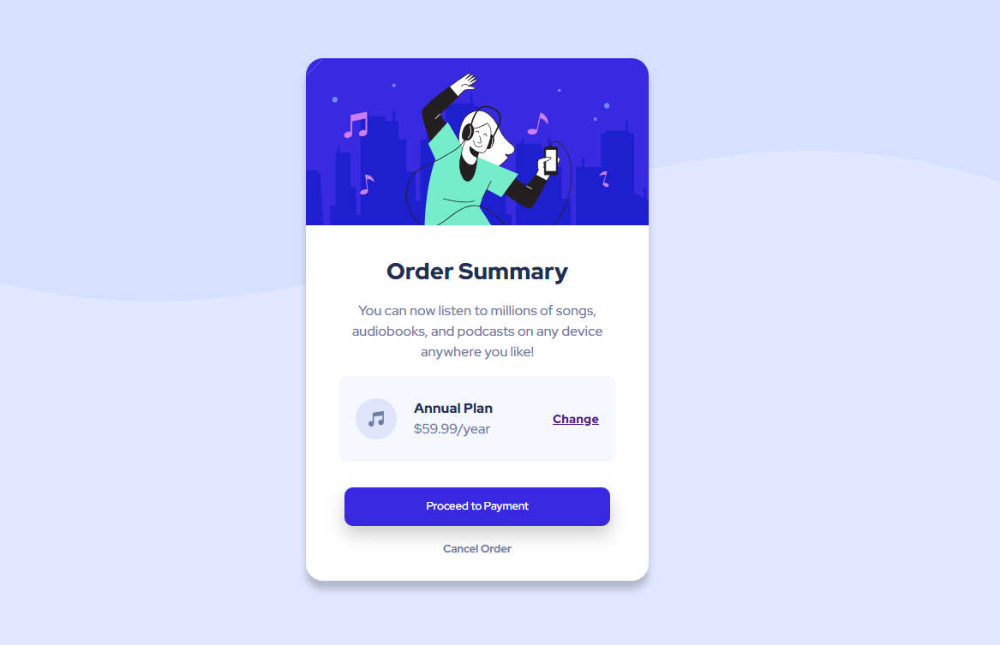

# Frontend Mentor - Order summary card solution

This is a solution to the [Order summary card challenge on Frontend Mentor](https://www.frontendmentor.io/challenges/order-summary-component-QlPmajDUj). Frontend Mentor challenges help you improve your coding skills by building realistic projects. 

## Table of contents

- [Overview](#overview)
  - [The challenge](#the-challenge)
  - [Screenshot](#screenshot)
  - [Links](#links)
- [My process](#my-process)
  - [Built with](#built-with)
  - [What I learned](#what-i-learned)
  - [Continued development](#continued-development)
  - [Useful resources](#useful-resources)
- [Author](#author)
- [Acknowledgments](#acknowledgments)

## Overview

### The challenge

Users should be able to:

- See hover states for interactive elements

### Screenshot



### Links

- Solution URL: [HTML](https://github.com/ZahidurRahman8759/Order-Summary-Component/blob/c802e857997a39501b452b83f0f17d3252984f45/index.html)
- Solution URL: [CSS](https://github.com/ZahidurRahman8759/Order-Summary-Component/blob/c802e857997a39501b452b83f0f17d3252984f45/style.css)
- Live Site URL: [LIVE STIE](https://zahidurrahman8759.github.io/Order-Summary-Component/)

## My process

### Built with

- Semantic HTML5 markup
- CSS custom properties
- Flexbox
- Mobile-first workflow

### What I learned

By doing this project I learned how to set a background image perfectly without any repetition and stretching the picture. The lines of code below will help you set the background.

```css
body {
  background: url(./images/pattern-background-desktop.svg) no-repeat top center;
  background-size: 100%;
}
```

## Author

- Frontend Mentor - [@ZahidurRahman8759](https://www.frontendmentor.io/profile/ZahidurRahman8759)
